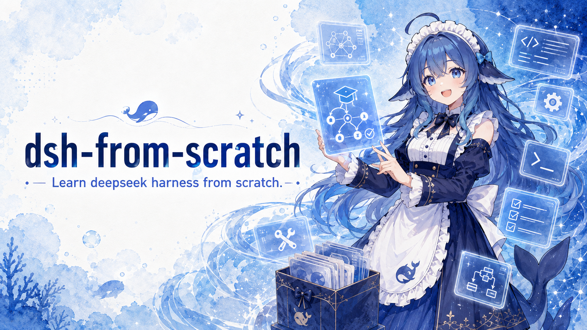

# DeepSeek Harness from Scratch

[English](./README.md) | [中文版](./README.zh.md)

<p align="center">
  
</p>

An offline-capable TypeScript tutorial that explains the main runtime mechanisms of DeepSeek Harness through six incremental implementations.

DeepSeek Harness, abbreviated as DSH, provides the runtime in which a language model performs tasks. It assembles model input, exposes tools, executes validated tool calls, records the run, and continues when one model response is not enough to finish the task. This repository reduces those mechanisms to an implementation that can be read, executed, and tested. It also includes an interactive tutorial site generated from the source code.

Each chapter uses an independent deterministic example with only the inputs and runtime events needed for its question. The chapters progressively add context projection, plugin lifecycles, a session log, dynamic plugins, and long-task continuation. Readers can inspect the source, model requests, and runtime state changed by each mechanism.

This project focuses on teaching the runtime mechanisms with a deliberately small codebase and explicit execution boundaries. It does not provide a compatibility layer for DeepSeek Harness or cover the full product's permissions, persistence, scheduling, and multi-agent features.

## Quick start

You need Node.js 22 or later. The pnpm 11 version is pinned in `package.json`.

```sh
git clone https://github.com/tsrigo/dsh-from-scratch.git
cd dsh-from-scratch
corepack enable
pnpm install
TUTORIAL_LOCALE=en pnpm exec tsx scripts/generate-tutorial-data.ts
pnpm site:dev
```

## Run the real-model demo

The following command runs a bounded Python task. The Agent must create `hello.py`, run it with the provided verifier, and confirm that the output is exactly `Hello, world!`. The file is written to `demo-python/hello.py` by default.

```sh
pnpm demo
```

With `DEEPSEEK_API_KEY` set, the command uses a real DeepSeek model. Without it, the command replays the stored model decisions offline, without network access or simulated stream timing. You can choose the model and workspace with environment variables and an option:

```sh
DEEPSEEK_API_KEY=your-key \
DEEPSEEK_MODEL=deepseek-chat \
pnpm demo -- --workspace ./tmp/python-hello
```

Model requests, tool calls, and Python program output are recorded in the `SessionLog`. To run the original offline checkout sample, use `pnpm demo:checkout`.

The command above generates the English TypeScript data. To generate the Chinese data, run the generator without `TUTORIAL_LOCALE`:

```sh
pnpm exec tsx scripts/generate-tutorial-data.ts
```

Data generation and site browsing make no model requests and require no application programming interface (API) key.

## Run the tutorial site

The site contains:

- Four TypeScript primer cards covering type annotations, `interface`, `async` / `await`, and discriminated unions.
- Six independent mechanism examples with source code, per-chapter diffs, model requests, Session Events, execution traces, and plugin relationships aligned with the prose.
- Estimates of the stable prefix, first changed part, and token count for adjacent requests. These values explain request structure only. Provider cache hits and billing must be determined from provider data.

The generator reads the English chapter configuration in [`docs/checkpoints.en.json`](./docs/checkpoints.en.json), the lessons in [`docs/lessons-en/`](./docs/lessons-en/), and [`docs/typescript-primer.en.md`](./docs/typescript-primer.en.md). It extracts material from tutorial checkpoints and the current TypeScript source, then writes [`website/public/generated/tutorial.en.json`](./website/public/generated/tutorial.en.json). The Chinese build uses [`docs/checkpoints.json`](./docs/checkpoints.json) and writes [`website/public/generated/tutorial.json`](./website/public/generated/tutorial.json). Generation also checks source ranges, code-guide coverage, and exact request reconstruction where request evidence comes from Session Events.

## The six chapters

The chapter titles and questions below match the English tutorial site.

### Chapter 1 · Agent Loop

> What does DSH's Agent Loop look like?

`Agent.runTurn()` divides a Turn, one continuous execution, into Steps. Each Step contains one model request and its tool execution. The Harness builds a request from the current state. When the model returns a Tool Call, the Harness validates its arguments with JSON Schema, executes the tool, and adds the Tool Result to the next request. A Turn ends when the model stops calling tools. Exceeding `maxSteps` terminates it with an explicit error.

The chapter also shows how Programmatic Tool Calling (PTC) can organize several actions as a TypeScript program. The repository presents this as a static comparison and does not implement a Code Runtime.

### Chapter 2 · Context and Cache Reuse

> How is context organized, and how does DSH optimize cache reuse?

Each model request is a projection of the complete record. For long tool results, the model view keeps the beginning, the end, and an explicit omitted-character count. The original result remains in the session record. Stable system instructions and tool schemas appear first, messages are appended in order, and Step-specific context appears last. This ordering preserves a longer identical prefix between adjacent requests.

The site compares the longest identical canonical prefix and estimates its token count. The implementation does not call or simulate a provider Prompt Cache.

### Chapter 3 · Everything Is a Plugin

> How does DSH make everything a plugin?

`Context` is the shared registration interface for plugins. A plugin can provide a runtime Service, register a Tool, contribute a system Prompt, and add an Event Listener. Every contribution records its owner and an effect that manages cleanup over the plugin lifecycle. If setup fails or a mounted plugin is removed, `Context` runs those cleanup functions in reverse order.

The small runtime retains the Cordis lifecycle features needed by the tutorial: dependency access, capability ownership, setup rollback, idempotent removal, and runtime inspection.

### Chapter 4 · Making Every Run Traceable

> How does DSH record and preserve an Agent run?

`SessionLog` appends Turn and Step boundaries, user messages, model responses, tool calls, tool results, request headers, context checkpoints, plugin changes, and Goal state changes in execution order. Each event receives a monotonically increasing identifier, and stored events are not edited in place.

`buildRequest()` reconstructs the input for a selected Step from these events. `replayTrace()` derives the execution trace from the same source. A context checkpoint replaces earlier history only in later model projections; the original events remain available. The minimal runtime keeps the log in memory, and the tutorial generator serializes it into static JSON for the site.

### Chapter 5 · Runtime Self-Evolution

> How does DSH continuously evolve at runtime?

The resident Runtime Tools expose `cordis_inspect`, `cordis_define`, `cordis_run`, `cordis_stop`, and `cordis_undefine` to the Agent. The Agent can inspect current capabilities, submit Cordis plugin code, mount the plugin, call a new tool to verify its behavior, and then stop the plugin or delete its definition.

Dynamic plugins still pass through `Context.mount()` from Chapter 3, so new tools and prompts appear in subsequent model requests and use the same cleanup path on removal. Node.js loads the code with `node:vm`. This mechanism is intended for trusted tutorial fixtures and is not a security sandbox for untrusted code.

### Chapter 6 · Continuing Long-Running Tasks

> How does DSH keep long-running tasks moving to completion?

`LongTaskRunner` stores a Goal, its current status, the number of started Rounds, and a round limit outside the Agent Loop. Each Round starts a regular Agent Turn and reuses the same `Context`, workspace, and `SessionLog`. A Round returns structured progress, completion, or blocked information. The outer runner then starts another Round or finishes with `completed`, `blocked`, or `max-rounds`.

Goal, Round, Turn, and Step represent a long-term objective, one continuation attempt, one continuous execution, and one model request respectively. Tests cover normal completion, no observable progress, an explicit block, and the configured round limit.

## Deploy the tutorial site

```sh
TUTORIAL_LOCALE=en pnpm exec tsx scripts/generate-tutorial-data.ts
pnpm site:build
pnpm site:dev
```

`pnpm site:build` creates the production site in `dist/`. For local viewing, run `pnpm site:dev` and open the address printed in the terminal.

## Deliberate scope limits

The TypeScript implementation omits these production features:

- The complete DeepSeek Harness plugin catalog, preset loading, and configuration hot reload.
- A Code Runtime for PTC, a general-purpose shell, arbitrary file access, and network tools.
- Permissions, approval flows, process isolation, and a security sandbox for untrusted plugin code.
- JSON Lines persistence, SQLite persistence, and process-restart recovery for the Session Log.
- Schedules, background jobs, subagents, and workflows.
- Measurement of provider-side cache hits, billing simulation, and a general context-compaction policy.

These limits keep the code in each chapter directly connected to the question it answers. See [DeepSeek Harness](https://github.com/deepseek-ai/deepseek-harness) for the complete product.

## References and license

The runtime behavior is informed by [DeepSeek Harness](https://github.com/deepseek-ai/deepseek-harness). The incremental chapter structure and the alignment of prose, source, and recorded execution were informed by [pi-from-scratch](https://github.com/SaladDay/pi-from-scratch). The staged, reproducible motion design was informed by [vibe-motion/skills](https://github.com/vibe-motion/skills). All source code, prose, chapter structure, components, layouts, motion, and execution data in this repository were created independently.

The project uses the [MIT License](./LICENSE). It is an independent educational implementation and is not affiliated with, authorized by, or developed in partnership with DeepSeek or its affiliates.
